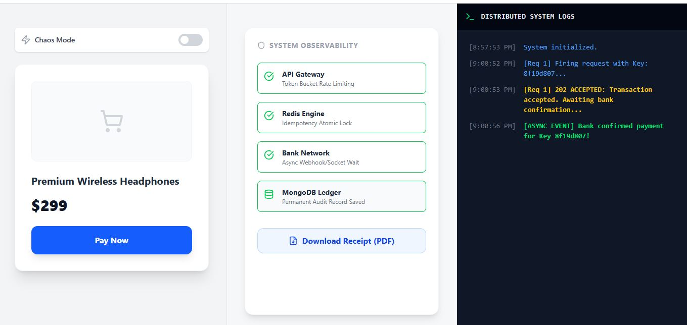
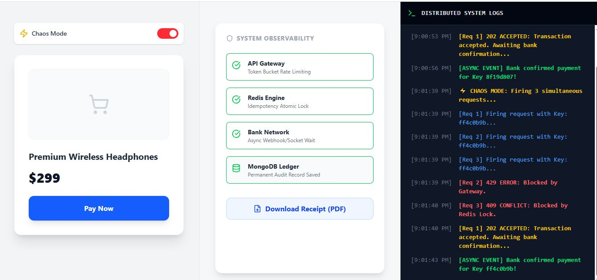
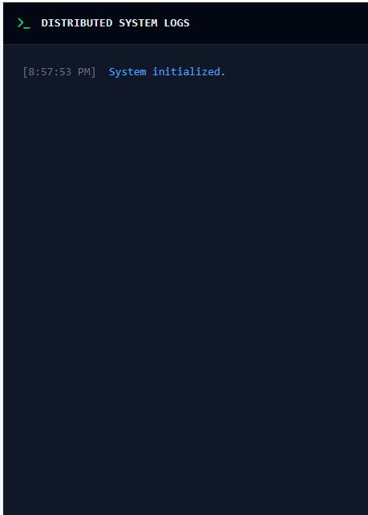
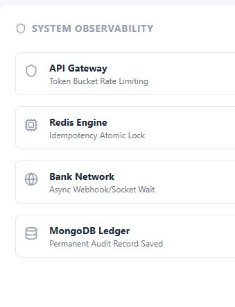
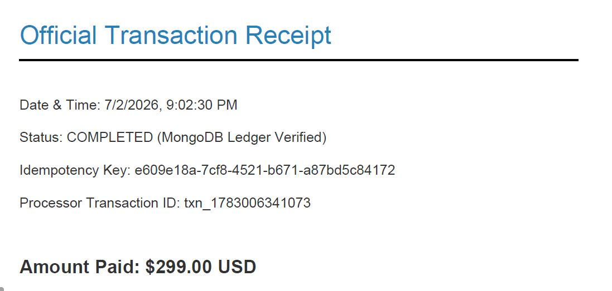

# Distributed Idempotent Payment Gateway

A production-inspired distributed payment processing system built with the MERN stack. The project demonstrates how modern payment platforms handle duplicate requests, concurrency, rate limiting, asynchronous processing, and fault recovery using Redis, MongoDB, WebSockets, and event-driven architecture.

The system is designed to simulate real-world payment gateway behavior by ensuring exactly-once transaction processing, protecting APIs from abuse, and maintaining a permanent transaction ledger.

---

# Features

- Distributed idempotency using Redis to prevent duplicate payment execution.
- Redis-backed token bucket rate limiter for API protection.
- Asynchronous payment processing with immediate client acknowledgement.
- Real-time transaction updates using Socket.io.
- Automatic recovery of interrupted payment locks through stale lock detection.
- Persistent transaction ledger stored in MongoDB.
- Downloadable PDF payment receipts generated in the browser.
- High-concurrency architecture capable of safely handling repeated client requests.
- Clean separation of controllers, services, middleware, and database layers.

---

# System Architecture

## Architecture Diagram


```
                Client (React)
                       │
                       │
        Generates UUID Idempotency Key
                       │
                       ▼
               Express API Gateway
                       │
         ┌─────────────┴─────────────┐
         │                           │
         ▼                           ▼
 Rate Limiter (Redis)      Idempotency Lock (Redis)
         │                           │
         └─────────────┬─────────────┘
                       ▼
          Background Payment Processor
                       │
              Simulated Payment Engine
                       │
          Save Transaction to MongoDB
                       │
                       ▼
         Socket.io Event Notification
                       │
                       ▼
               React Frontend Updates
```

---

# Request Flow

### 1. Client Request

The frontend generates a unique UUIDv4 and sends it in the `Idempotency-Key` request header.

```
POST /api/v1/payments
```

Headers

```
Content-Type: application/json
Idempotency-Key: <UUIDv4>
```

Body

```json
{
  "amount": 299,
  "currency": "USD"
}
```

---

### 2. API Gateway

Incoming requests first pass through the Redis-backed rate limiter.

If the client exceeds the configured request limit, the API responds with:

```
429 Too Many Requests
```

---

### 3. Idempotency Layer

Redis stores the incoming Idempotency Key.

- New key → Payment processing starts.
- Existing completed key → Previously generated receipt is returned.
- Existing processing key → Request is rejected to prevent duplicate execution.

Possible responses:

```
202 Accepted
200 OK
409 Conflict
```

---

### 4. Background Processing

The API immediately returns:

```
202 Accepted
```

The payment is processed asynchronously without blocking the client request.

---

### 5. Transaction Completion

After processing:

- Transaction is saved to MongoDB.
- Receipt is generated.
- Socket.io emits a real-time notification.
- Frontend updates automatically.

---

# Technology Stack

## Frontend

- React.js
- Vite
- Tailwind CSS
- Socket.io Client
- jsPDF
- Lucide React

## Backend

- Node.js
- Express.js
- Socket.io
- Mongoose
- ioredis

## Databases

- MongoDB Atlas
- Upstash Redis

---

# Project Structure

```
idempotent-payment-api/

├── frontend/
│   ├── src/
│   │   ├── App.jsx
│   │   ├── main.jsx
│   │   └── index.css
│   ├── package.json
│   └── vite.config.js
│
└── backend/
    ├── src/
    │
    ├── config/
    │   ├── mongo.js
    │   └── redis.js
    │
    ├── controllers/
    │   └── payment.controller.js
    │
    ├── middlewares/
    │   └── rateLimiter.js
    │
    ├── models/
    │   └── receipt.model.js
    │
    ├── services/
    │   ├── idempotency.service.js
    │   └── payment.service.js
    │
    ├── app.js
    └── server.js

```

---

# API Documentation

## POST /api/v1/payments

Initiates a payment transaction.

### Headers

| Header | Required |
|----------|----------|
| Content-Type | Yes |
| Idempotency-Key | Yes |

### Request

```json
{
  "amount": 299,
  "currency": "USD"
}
```

### Response Codes

| Status | Description |
|----------|-------------|
| 202 Accepted | Payment accepted and processing asynchronously |
| 200 OK | Existing completed transaction returned |
| 409 Conflict | Payment with the same Idempotency Key is already processing |
| 429 Too Many Requests | Rate limit exceeded |

---

# Local Installation

## Prerequisites

- Node.js 18+
- Git
- MongoDB Atlas (or local MongoDB)
- Upstash Redis (or local Redis)

---

## Clone Repository

```bash
git clone https://github.com/<username>/idempotent-payment-api.git

cd idempotent-payment-api
```

---

## Backend Environment Variables

Create a `.env` file inside the backend directory.

```env
PORT=3000

MONGO_URI=mongodb+srv://<username>:<password>@cluster.mongodb.net/payment-api

REDIS_URL=rediss://default:<password>@<upstash-endpoint>.upstash.io:6379
```

---

## Install Dependencies

Backend

```bash
cd backend
npm install
```

Frontend

```bash
cd payment-frontend
npm install
```

---

## Run Backend

```bash
cd backend
node src/server.js
```

Expected output

```
Server running on port 3000
MongoDB Connected
Redis Connected
Socket.io Initialized
```

---

## Run Frontend

```bash
cd payment-frontend
npm run dev
```

Open

```
http://localhost:5173
```

---

# Testing

1. Open the frontend application.
2. Click **Pay Now**.
3. Observe the immediate `202 Accepted` response.
4. Wait for the WebSocket event.
5. Verify that the transaction is stored in MongoDB.
6. Download the generated PDF receipt.
7. Re-submit the same Idempotency Key to verify duplicate prevention.
8. Send repeated requests to trigger the Redis rate limiter.

---

# Engineering Concepts Demonstrated

- Distributed Systems
- Idempotency
- Concurrency Control
- Event-Driven Architecture
- Asynchronous Processing
- Redis Data Structures
- Rate Limiting
- WebSockets
- Fault Recovery
- Backend System Design
- REST API Design
- MongoDB Data Persistence

---

## Screenshots

### Payment Process UI

<p align="center">
  
</p>

<br><br>

### Chaos Mode

<p align="center">
  
</p>

<br><br>

### Distributed System Logs

<p align="center">
  
</p>

<br><br>

### Payment UI

<p align="center">
  
</p>

<br><br>

### System Observability

<p align="center">
  
</p>

<br><br>

### Payment Receipt

<p align="center">
  
</p>


# Future Improvements

- Integration with Stripe or Razorpay Sandbox
- Distributed Message Queue (RabbitMQ / Kafka)
- Horizontal Scaling with Redis Cluster
- Docker and Docker Compose
- Kubernetes Deployment
- Prometheus and Grafana Monitoring
- OpenTelemetry Distributed Tracing
- JWT Authentication and Role-Based Authorization
- CI/CD Pipeline using GitHub Actions

---

# Author

**Sahil Kumar**

Software Engineer

LinkedIn: www.linkedin.com/in/sahil-kumar1704

GitHub: https://github.com/SahilKumar-projects

---